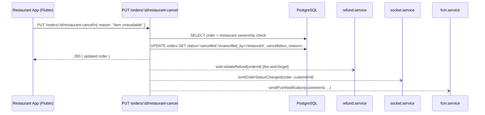

# Design Document: Restaurant Order Cancellation

## Overview

This feature adds a self-service cancellation path for restaurant owners. Currently only customers and admins can cancel orders. The new flow lets a restaurant owner cancel any order in `confirmed` or `ready_for_pickup` status, supplying a reason from a predefined list. The backend records the cancellation, fires a refund, and notifies the customer via Socket.IO and FCM — all reusing existing infrastructure.

The change touches four layers:

| Layer | Change |
|---|---|
| Database | Migration 007: add `cancelled_by` column to `orders` |
| Backend | New `PUT /orders/:id/restaurant-cancel` route in `orders.ts` |
| Flutter restaurant app | Cancel button + confirmation dialog on `_OrderCard` |
| Admin dashboard | Show `cancelled_by` badge in the orders table |

---

## Architecture

The cancellation request flows through the existing Express → service → database pipeline and reuses the existing `refund.service.ts`, `socket.service.ts`, and `fcm.service.ts` without modification.



The restaurant app never calls the existing customer `PUT /orders/:id/cancel` endpoint — it calls the new dedicated endpoint, which enforces restaurant-role ownership and the predefined reason list.

---

## Components and Interfaces

### 1. Database Migration (`007_restaurant_cancellation.sql`)

Adds a `cancelled_by` column to the `orders` table:

```sql
ALTER TABLE orders
  ADD COLUMN IF NOT EXISTS cancelled_by VARCHAR(20)
    CHECK (cancelled_by IN ('customer', 'restaurant', 'admin'));

CREATE INDEX IF NOT EXISTS idx_orders_cancelled_by ON orders(cancelled_by);
```

The column is nullable — existing rows and non-cancelled orders leave it `NULL`. The `CHECK` constraint enforces the three allowed actors.

### 2. Backend — `Order` model (`order.model.ts`)

Add `cancelled_by` to the `Order` interface:

```typescript
cancelled_by: 'customer' | 'restaurant' | 'admin' | null;
```

### 3. Backend — `updateOrderStatus` (`order.service.ts`)

Extend the `extra` parameter handling to include `cancelled_by`:

```typescript
if (extra?.cancelled_by !== undefined) {
  fields.push(`cancelled_by = $${idx++}`);
  values.push(extra.cancelled_by);
}
```

### 4. Backend — New endpoint (`routes/orders.ts`)

```
PUT /orders/:id/restaurant-cancel
Auth: authenticate + authorize('restaurant')
Body: { reason: string }   // must be non-empty
```

**Request validation:**
- `reason` — required, non-empty string (validated with `body('reason').trim().notEmpty()`)

**Handler logic:**
1. Fetch the order by `:id`; return 404 if not found.
2. Look up the restaurant owned by `req.userId`; return 403 if none found or if `order.restaurant_id !== restaurant.id`.
3. If `order.status` is not in `['confirmed', 'ready_for_pickup']`, return 409.
4. Call `orderService.updateOrderStatus(order.id, 'cancelled', { cancellation_reason, cancelled_by: 'restaurant', cancelled_at: new Date() })`.
5. Fire-and-forget `initiateRefund(order.id)`.
6. Call `emitOrderStatusChanged(updated, order.customer_id)`.
7. Call `emitToRestaurant(restaurantOwnerId, updated)` (so the restaurant's own socket session also reflects the change).
8. Call `sendPushNotification(order.customer_id, 'Order Cancelled', reason, { type: 'order_cancelled', orderId })`.
9. Return 200 with the updated order.

**Predefined reasons** are enforced on the Flutter side (UI picker). The backend accepts any non-empty string so it remains flexible for future callers (admin tools, scripts).

### 5. Backend — Admin orders query (`routes/admin.ts`)

The `GET /admin/orders` query is extended to include `cancelled_by` in the `SELECT`:

```sql
SELECT o.id, o.status, o.total, o.payment_status,
       o.cancellation_reason, o.cancelled_by,   -- added
       o.created_at, ...
```

### 6. Flutter restaurant app

#### `OrderModel` (`order_model.dart`)

Add `cancellationReason` and `cancelledBy` fields (nullable):

```dart
final String? cancellationReason;
final String? cancelledBy;
```

#### `OrderService` (`order_service.dart`)

New method:

```dart
Future<void> cancelOrder(String orderId, String reason) async {
  await _client.dio.put(
    '${ApiConstants.orders}/$orderId/restaurant-cancel',
    data: {'reason': reason},
  );
}
```

#### `ApiConstants` (`api_constants.dart`)

No new constant needed — the URL is constructed dynamically from `ApiConstants.orders`.

#### `_OrderCard` widget (`orders_screen.dart`)

**Cancel button visibility:**
- Show "Cancel Order" button when `order.status` is `confirmed` or `ready_for_pickup`.
- Hide it for all other statuses (including `rider_assigned`, `picked_up`).

**Confirmation dialog flow:**
1. Tapping "Cancel Order" opens an `AlertDialog`.
2. The dialog contains a `RadioListTile` group for the predefined reasons:
   - "Item unavailable"
   - "Kitchen closed"
   - "Too busy"
   - "Ingredient ran out"
   - "Other"
3. The "Confirm" button is disabled until a reason is selected.
4. On confirm: call `orderService.cancelOrder(order.id, selectedReason)`, show a `CircularProgressIndicator` in the button, disable interaction.
5. On success: pop the dialog, call `onCancelled()` callback (triggers `_load()` in the parent screen), show a `SnackBar` with "Order cancelled".
6. On error: pop the dialog, show a `SnackBar` with the error message from the API response.

The `_OrderCard` widget receives an `onCancelled` callback from `OrdersScreen`, keeping state management in the parent (consistent with the existing `onMarkReady` pattern).

### 7. Admin dashboard (`admin/src/app/dashboard/orders/page.tsx`)

**`Order` interface** — add `cancelled_by`:

```typescript
cancelled_by: 'customer' | 'restaurant' | 'admin' | null;
```

**Orders table** — add a "Cancelled By" column after "Status". Only rendered when `o.status === 'cancelled'`:

```tsx
<td className="px-4 py-3">
  {o.status === 'cancelled' && o.cancelled_by ? (
    <span className={`px-2 py-1 rounded-full text-xs font-medium ${CANCELLED_BY_COLORS[o.cancelled_by]}`}>
      {o.cancelled_by}
    </span>
  ) : <span className="text-gray-400">—</span>}
</td>
```

Color map:
- `customer` → blue badge
- `restaurant` → orange badge
- `admin` → red badge

The existing status filter already covers filtering to `cancelled` orders, so no additional filter control is needed.

---

## Data Models

### `orders` table (after migration 007)

| Column | Type | Notes |
|---|---|---|
| `cancelled_by` | `VARCHAR(20)` | `NULL` \| `'customer'` \| `'restaurant'` \| `'admin'` |

All other columns are unchanged. The existing `cancellation_reason` and `cancelled_at` columns are reused.

### Request body — `PUT /orders/:id/restaurant-cancel`

```typescript
{
  reason: string; // non-empty; one of the predefined values by convention
}
```

### Response body (success)

Standard `successResponse` wrapper around the updated `Order` object, which now includes `cancelled_by: 'restaurant'`.

### Admin orders response

The `GET /admin/orders` response objects gain `cancelled_by: string | null`.

---

## Correctness Properties

*A property is a characteristic or behavior that should hold true across all valid executions of a system — essentially, a formal statement about what the system should do. Properties serve as the bridge between human-readable specifications and machine-verifiable correctness guarantees.*

### Property 1: Cancellation round-trip persists status, reason, and actor

*For any* order in `confirmed` or `ready_for_pickup` status and any non-empty reason string, calling the restaurant-cancel endpoint SHALL result in the stored order having `status = 'cancelled'`, `cancellation_reason` equal to the submitted reason, `cancelled_by = 'restaurant'`, and a non-null `cancelled_at` timestamp.

**Validates: Requirements 1.1, 5.1, 5.3**

### Property 2: Ownership guard rejects cross-restaurant cancellations

*For any* restaurant owner and any order that belongs to a different restaurant, the restaurant-cancel endpoint SHALL return HTTP 403 and leave the order status unchanged.

**Validates: Requirements 1.2, 1.4**

### Property 3: Status guard rejects non-cancellable orders

*For any* order whose status is in `{picked_up, delivered, cancelled, pending_payment, payment_failed}`, the restaurant-cancel endpoint SHALL return HTTP 409 and leave the order status unchanged.

**Validates: Requirements 1.3**

### Property 4: Refund is always invoked on successful cancellation

*For any* order successfully cancelled by a restaurant owner, `initiateRefund` SHALL be called exactly once with that order's ID.

**Validates: Requirements 2.1**

### Property 5: Customer is always notified on successful cancellation

*For any* order successfully cancelled by a restaurant owner, `emitOrderStatusChanged` SHALL be called with the customer's user ID, and `sendPushNotification` SHALL be called with the customer's user ID, title `"Order Cancelled"`, and a body containing the cancellation reason.

**Validates: Requirements 3.1, 3.2**

### Property 6: Cancel button visibility matches order status

*For any* order, the cancel button SHALL be visible if and only if the order status is `confirmed` or `ready_for_pickup`. For all other statuses the button SHALL be absent.

**Validates: Requirements 4.1, 4.6**

### Property 7: Successful cancellation removes order from active list

*For any* active orders list containing an order, after that order is successfully cancelled, the order SHALL no longer appear in the active orders list rendered by the restaurant app.

**Validates: Requirements 4.4**

---

## Error Handling

| Scenario | Layer | Behaviour |
|---|---|---|
| Order not found | Backend | 404 `Order not found` |
| Caller is not the restaurant owner | Backend | 403 `Forbidden` |
| Order in non-cancellable status | Backend | 409 `Order cannot be cancelled in current status` |
| Missing or empty `reason` | Backend | 422 validation error from `express-validator` |
| Unauthenticated request | Backend | 401 (existing `authenticate` middleware) |
| Non-restaurant role | Backend | 403 (existing `authorize('restaurant')` middleware) |
| Refund service failure | Backend | Logged via `logger.error`; does not propagate to caller (fire-and-forget) |
| FCM delivery failure | Backend | Logged via `logger.error` inside `sendPushNotification`; does not propagate |
| Socket emission when customer offline | Backend | `queueEvent` stores the event for up to 5 minutes (existing behaviour) |
| API error in Flutter app | Flutter | `SnackBar` with error message; dialog dismissed; order card unchanged |
| No reason selected in dialog | Flutter | "Confirm" button disabled; submission blocked |

---

## Testing Strategy

### Unit / Integration tests (Jest — `backend/src/tests/`)

A new test file `backend/src/tests/restaurant-cancel.test.ts` covers:

- **Example tests**
  - Unauthenticated request returns 401
  - Customer-role request returns 403
  - Missing `reason` returns 422

- **Edge case tests**
  - Each non-cancellable status (`picked_up`, `delivered`, `cancelled`, `pending_payment`, `payment_failed`) returns 409
  - Refund service throws after all retries — cancel response still succeeds and error is logged
  - FCM throws — cancel response still succeeds

### Property-based tests (fast-check — same test file)

The project uses Jest; [fast-check](https://fast-check.io/) is the property-based testing library for TypeScript. Each property test runs a minimum of **100 iterations**.

**Property 1 — Cancellation round-trip**
```
Tag: Feature: restaurant-order-cancellation, Property 1: cancellation round-trip persists status, reason, and actor
```
Generate: random `orderId` (UUID), random non-empty `reason` string, order in `confirmed` or `ready_for_pickup`.
Assert: returned order has `status='cancelled'`, `cancellation_reason === reason`, `cancelled_by === 'restaurant'`, `cancelled_at` is non-null.

**Property 2 — Ownership guard**
```
Tag: Feature: restaurant-order-cancellation, Property 2: ownership guard rejects cross-restaurant cancellations
```
Generate: random restaurant owner ID, random order belonging to a different restaurant ID.
Assert: endpoint returns 403; order status in DB is unchanged.

**Property 3 — Status guard**
```
Tag: Feature: restaurant-order-cancellation, Property 3: status guard rejects non-cancellable orders
```
Generate: random order with status drawn from `{picked_up, delivered, cancelled, pending_payment, payment_failed}`.
Assert: endpoint returns 409; order status in DB is unchanged.

**Property 4 — Refund invocation**
```
Tag: Feature: restaurant-order-cancellation, Property 4: refund is always invoked on successful cancellation
```
Generate: random valid cancellable order and reason.
Assert: `initiateRefund` mock was called exactly once with the order ID.

**Property 5 — Customer notification**
```
Tag: Feature: restaurant-order-cancellation, Property 5: customer is always notified on successful cancellation
```
Generate: random valid cancellable order and reason string.
Assert: `emitOrderStatusChanged` called with customer ID; `sendPushNotification` called with customer ID, title `"Order Cancelled"`, body containing the reason.

### Flutter widget tests (`mobile/restaurant/`)

A new test file `mobile/restaurant/test/order_card_cancel_test.dart` covers:

**Property 6 — Cancel button visibility**
```
Tag: Feature: restaurant-order-cancellation, Property 6: cancel button visibility matches order status
```
Generate: random `OrderModel` with status drawn from all possible statuses.
Assert: cancel button present iff status ∈ `{confirmed, ready_for_pickup}`.

**Property 7 — Order removed from list after cancellation**
```
Tag: Feature: restaurant-order-cancellation, Property 7: successful cancellation removes order from active list
```
Generate: random list of active orders, pick one to cancel.
Assert: after mock API success, the cancelled order's ID is absent from the rendered list.

**Example widget tests:**
- Tapping cancel button opens dialog with 5 radio options
- Confirm button disabled until a reason is selected
- Loading indicator shown while API call is in flight
- Error snackbar shown when API returns error; order card unchanged
